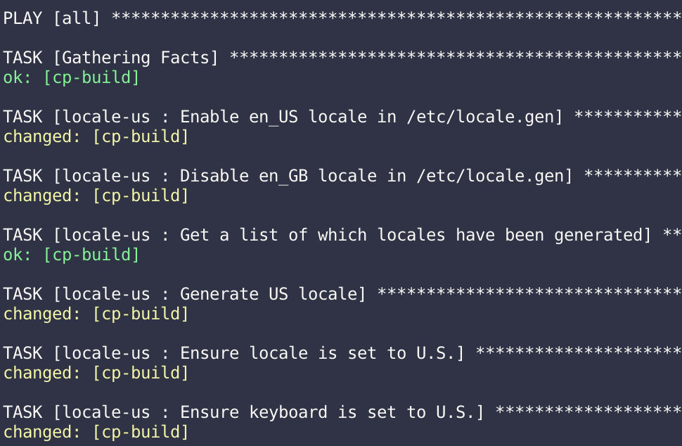

Ansible playbooks to build a CoachProxyOS Raspberry Pi image
============================================================

The CoachProxy image build is automated using the
[Ansible](https://docs.ansible.com/ansible/latest/index.html) system
configuration tool. Installing and and configuring Ansible is outside
the scope of these instructions.

Base Image Setup
----------------

Installing the CoachProxy software requires a network-accessible
Raspberry Pi (hereafter referred to as RPi) running the Raspbian
operating system. Installing Raspbian is outside the scope of this
documentation, however a few links and tips are provided below:

* At this time, the `2018-10-09-raspbian-stretch-lite.zip` image is the
  only version that has been tested with CoachProxy. It can be downloaded at:
  [raspbian_lite-2018-10-11](https://downloads.raspberrypi.org/raspbian_lite/images/raspbian_lite-2018-10-11/).
* Instructions for copying the Raspbian image onto an SD card are at:
  [Installing Images](https://www.raspberrypi.org/documentation/installation/installing-images/).
* Your local WiFi network SSID and passkey must be configured on the Raspbian
  image, and SSH enabled to allow remote login to the RPi. You can
  optionally connect the RPi via an ethernet cable and skip the WiFi
  configuration. Instructions for these settings are at:
  [Setting up a RPi Headless](https://www.raspberrypi.org/documentation/configuration/wireless/headless.md).
* Once the base Raspbian image is installed and your WiFi settings and SSH
  are configured, insert the SD card into an RPi and power it on.

Once the RPi is connected to your network, determine its IP address by
checking your router client list, and install your SSH authorized key.
This will allow you (and Ansible) to connect to the RPi without a
password. You'll need to enter the [default Raspbian
password](https://www.raspberrypi.org/documentation/linux/usage/users.md)
to install the key:

```
ssh-copy-id -i ~/.ssh/id_rsa pi@<ip address>
```

Next, update the `inventory/hosts.yml` file in this repository with the
RPi IP address so Ansible can connect and continue the configuration.

Lastly, update the `roles/base_os/files/public_keys/root-coachproxy` file
with your public SSH key. This key will be installed into the root
account on the RPi, enabling you to SSH into the device's root account
if needed.

CoachProxyOS Ansible Playbook
-----------------------------

Run the `coachproxyos.yml` playbook to perform the majority of the
installation and configuration. The install will take 20-40 minutes
and will download quite a bit of data over your Internet connection.

```
$ ansible-playbook coachproxyos.yml
```



Creating Reusable Image
-----------------------

The SD card is now ready to use. However, it's advisable to capture the
completed image to a file, so it can be restored in the future rather
than repeating all the above steps.

For example, to capture the SD card image using an Ubuntu Linux server,
the following steps can be used, after moving the RPi SD card to the
Linux server:

```
sudo umount /dev/mmcblk0p1 /dev/mmcblk0p2
sudo dd bs=4M if=/dev/mmcblk0 of=coachproxyos_1.0.img
```

