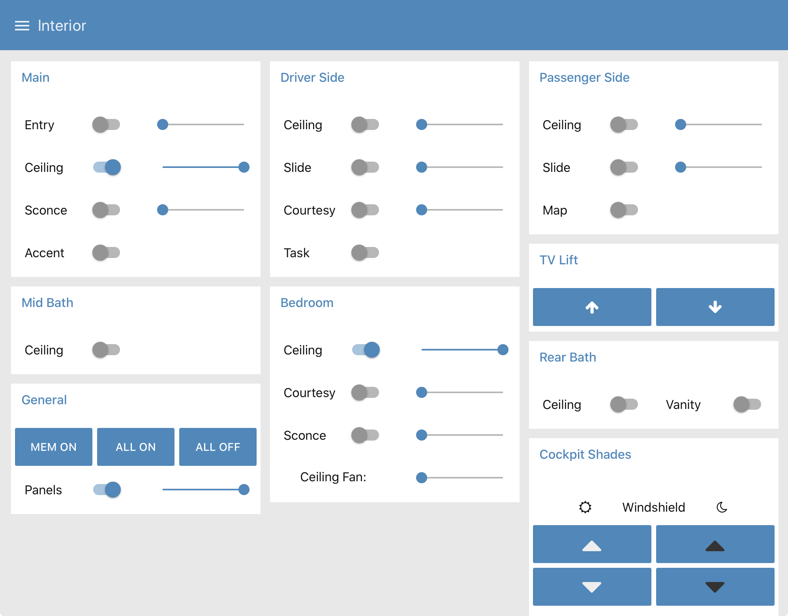

CoachProxyOS
============

CoachProxy**OS** is the **O**pen **S**ource version of the software behind
[CoachProxy](https://coachproxy.com), a device for interfacing
with, monitoring, and managing Tiffin motorhomes.

This repository provides a set of
[Ansible](https://docs.ansible.com/ansible/latest/index.html) playbooks
to create a functioning CoachProxyOS system image from a base Raspberry
Pi operating system.

Differences from the commercial CoachProxy Software
---------------------------------------------------

CoachProxyOS's RV monitoring and control capabilities are identical to
those of the commercial CoachProxy system. However, several changes have
been made to make it suitable for an Open Source Project. The major
changes are:

* CoachProxy's e-mail notification, remote access VPN service, and
  software update service depend on access to a cloud-based management
  server. These features have been removed in CoachProxy**OS** to eliminate
  that dependency and ensure CoachProxyOS can run as a stand-alone device.
  CoachProxyOS has a new third-party remote access capability built in,
  and restoring e-mail notifications is high on the priority list.
* CoachProxy requires the installation of a second, external WiFi
  adapter, while CoachProxyOS removes this requirement. CoachProxy uses
  one adapter to create a private hotspot which a user connects to from
  their browser, and from there configures the other adapter to connect to
  their local WiFi network. This adds significant complexity to the
  software and removing it for a DIY effort greatly simplifies the
  project. With CoachProxyOS, the WiFi configuration must be done by
  editing a file on the boot partition of the operating system image.
* CoachProxy configures its memory card to use a read-only filesystem
  with a RAM Disk overlay running on top of it. This was done to
  prevent corruption of the SD card, for example if power was lost while a
  file was being written. The overlayfs and read-only configuration has
  been removed from CoachProxyOS to reduce complexity and make DIY
  changes easier.
* The CoachProxyOS operating system image was built approximately one
  year after the operating system image for CoachProxy v3.x. This means
  CoachProxyOS includes newer versions of many system and support
  programs. In theory this should have little or no effect, but it is
  worth noting.

Other Information
-----------------

See the [INSTALL](INSTALL.md) file for instructions on creating a
CoachProxyOS image using Ansible.

See the [HOW_IT_WORKS](HOW_IT_WORKS.md) file for information on how to
build a Raspberry Pi device that can communicate with an RV, and how the
CoachProxyOS software works.

See the [ROADMAP](ROADMAP.md) file for information on what future
changes would benefit the project.

Screenshots
-----------

