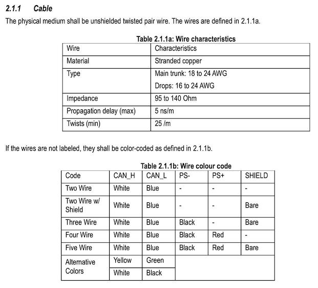

Hardware Build
==============

To build an RV-C interface device like CoachProxy, a few parts are
required:

* A Raspberry Pi 3B computer board ($40)
* A PiCAN 2 communications board ($60)
* A case for the combined boards ($10)
* A microSD memory card, any size ($10)
* An unshielded twisted pair (UTP) cable with 2 or 4 wires
* A crimp-on cable connector for the Tiffin/Spyder network port

Details
-------

The Raspberry Pi (RPi) 3 Model B is the recommended hardware choice. An
RPi 3B+ should also work, but has not been tested. An RPi 4 requires
additional power and is _not_ recommended, nor has it been tested.

To connect and communicate with the RV-C network in the motorhome, a CAN
Bus board must be added to the RPi. A board with built-in SMPS (switch
mode power supply) will enable the RPi to be powered by the CAN Bus
network, eliminating the need for a separate power supply. For example:
https://copperhilltech.com/pican2-can-interface-for-raspberry-pi-with-smps/

_Note: If purchasing this PiCan2 board from Copperhill Tech, ensure that
the 120 ohm termination resistor is disabled. To do this, remove any
jumper installed in the JP3 pins on the board (see section 1.6 of the
owners manual that comes with the PiCan2 board)._

For connection to a Tiffin motorhome, a 2- or 4-conductor CAN Bus cable
will need to be connected to the PiCAN2 board. A length of Category 6
ethernet cable (contaiing four pairs of wires) can be used, with one
pair of wires used for CAN communication. A second pair of wires may be
usable for 12V power, depending on the wire's gauge. see section 2.1.1
of the [RVC Specification](http://www.rv-c.com/?q=node/75) for more
information (excerpt attached below):

A [3M Mini-Clamp
Plug](https://www.digikey.com/product-detail/en/3m/37104-2165-000%20FL%20100/3M155844-ND/1238214)
connector should be added to the other end of the cable. This connector
will plug into the Tiffin network panel, usually in the bedroom,
bathroom, or closet of the RV.

Purchasing options
------------------

An RPi 3B+ with PiCAN2 board already attached can be purchased at:
https://copperhilltech.com/raspberry-pi-3-b-system-with-single-can-bus-interface/
for $150, rather than purchasing the two boards separately and
assembling them.

If planning to power the device through the Spider network cable, be
sure to select the "Extended Input Power Range" option.

